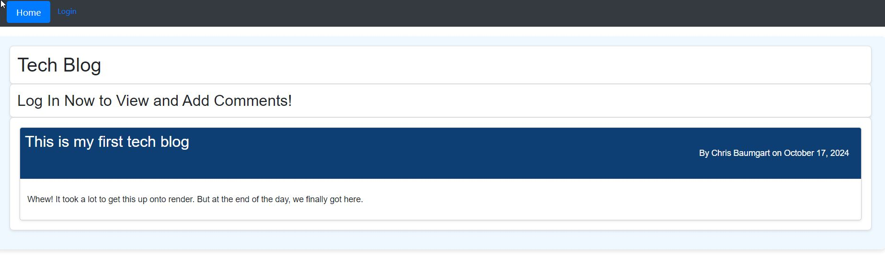
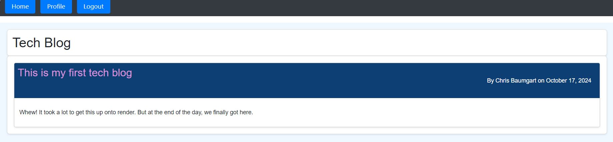
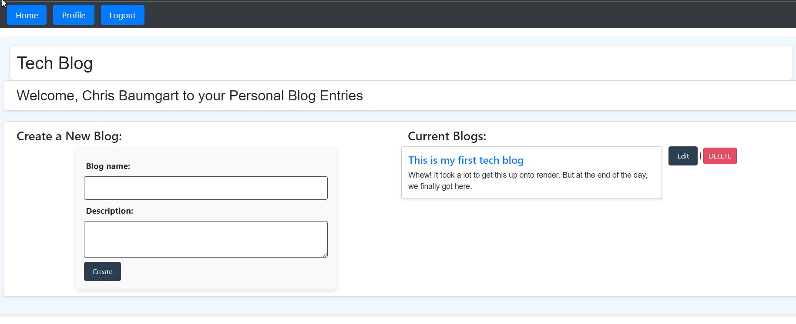

# Tech Blog

## Description

This project was the first project we did where we had to employ a full MVC (Model View Controller) model. This Tech Blog stores data in a PostgreSQL database. It also uses handlebars for individual element handling. Users can see the home page with all the blogs on display, and have the option to log in or sign up to view their own blogs, see comments, or even add their own.

## Table of Contents (Optional)

If your README is long, add a table of contents to make it easy for users to find what they need.

- [Installation](#installation)
- [Usage](#usage)
- [Credits](#credits)
- [License](#license)

## Installation

No steps need to be performed to use this app. This app was rendered on Render and is connected to a PostgreSQL database.  
For my own use, I did need to install dependencies (npm i) and initialize a local database.

## Usage

Users can navigate to [https://techblog-bihy.onrender.com](https://techblog-bihy.onrender.com) to view the blog. The blog page is rendered as  until a user logs in. Users can click the "Login" button and be redirected to a page where they can either log in or create their own username and password.
Please note, all fields in the sign up section are required.
Once logged in, the home page will render all headers for blogs as . Users can add and view comments from there. Users can also click the "Profile" button to view all their own blog posts.

Here they can add new posts, edit existing posts, or delete old posts. They can also view the comments for each blog. Users will be logged out after 24 hours of activity.

## Credits

This Tech blog was created by [Chris Baumgart](https://github.com/cbaumgart004)

## License

## This product is licensed with an MIT license and can be viewed [here](https://github.com/cbaumgart004/techBlog/blob/main/LICENSE)

## How to Contribute

- CSS Formatting. Everyone loves a good clean app. Feel free to add your suggestions!
- Efficiency. How could this code be more DRY? Feel free to make pull requests from the repo [here](https://github.com/cbaumgart004/techBlog)
